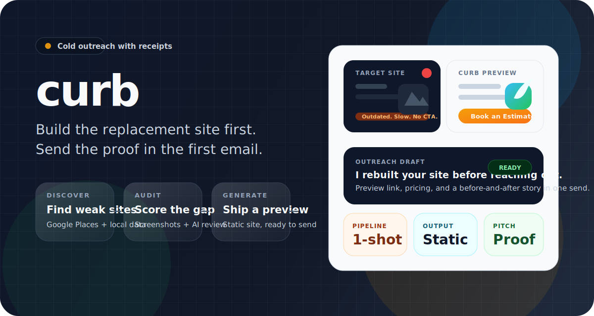

# curb

<p align="center">
  
</p>

<p align="center"><strong>Cold outreach with receipts.</strong></p>

<p align="center">Discover weak local-business sites, rebuild them locally, and send the finished preview in the first email.</p>

Curb is a local-first, one-shot website generator for local businesses.

It helps you find a nearby business with no site or a weak one, generate a replacement, preview it locally, and make your first sales contact by emailing them the finished website.

Most web design outreach sells possibility.

Curb sells proof.

## The Pitch

Instead of sending:

> "Hey, I could redesign your website."

Curb lets you send:

> "Hey, I already rebuilt it. Here it is."

That changes the conversation. The cold email is no longer a pitch for hypothetical work. It is a reveal.

This is not another generic AI site builder. It is an outbound engine for selling websites to local businesses by building first and asking second.

## What Curb Does

- Discovers local businesses through Google Places
- Enriches business records with contact and location data
- Audits an existing website with screenshots and AI review
- Flags weak, outdated, or missing sites
- Generates a tailored static replacement site
- Previews generated sites inside the local app
- Drafts outreach emails with a preview link and pricing
- Exports handoff-ready site files
- Tracks the full pipeline in SQLite

## Why It Feels Different

- Local-first. Leads, settings, drafts, screenshots, and generated sites live on your machine.
- One-shot by design. The first touch is the completed website, not a discovery call.
- Static output. The deliverable is a real site, not a mockup.
- Human-in-the-loop. You review the audit, the site, and the email before anything gets sent.
- Model-agnostic. Use Anthropic, OpenAI, Google, or OpenRouter.
- Built for operators. This is closer to a sales system for freelancers and agencies than a generic website builder.

## How It Works

1. Discover local businesses by location and category.
2. Audit their current web presence.
3. Flag the ones that are easy to replace.
4. Generate a tailored site into `sites/<slug>/`.
5. Preview it from the local app.
6. Draft the outreach email with the preview URL.
7. Approve, send, and export if they bite.

## What "Local-First" Means Here

- `curb.db` stores the pipeline data.
- `sites/` stores generated websites.
- `.curb-runtime/` stores launcher and runtime state.
- `app/` contains the local dashboard and API routes.
- No auth is required just to use the product.

The default preview base URL is local. If you want prospects to open the site from your outreach email, set a public `Preview Base URL` in Settings before sending anything.

## Quick Start

### Requirements

- Node.js 20+
- Google Places API key
- One AI provider credential: Anthropic, OpenAI, Google, or OpenRouter

### Launch

Recommended:

- macOS: `./launch-curb.command`
- Linux: `./launch-curb.sh`
- Windows: `launch-curb.bat`

Manual:

```bash
cd app
npm install
npm run dev
```

Then open [http://localhost:3000](http://localhost:3000).

## First Run

1. Open `Settings`.
2. Add your Google Places key.
3. Connect an AI provider or paste an API key.
4. Set a reachable `Preview Base URL` if prospects need to view the site.
5. Add your outreach name, business name, address, and email.
6. Add pricing text for outreach drafts.
7. Run `Discover`, then `Audit`, then `Generate`, then `Outreach`.

## Repo Shape

```text
curb/
├── app/               # Next.js dashboard and local API routes
├── sites/             # generated static sites
├── prompts/           # AI prompt templates
├── scripts/           # launcher scripts
├── curb.db            # SQLite database
└── .curb-runtime/     # launcher/runtime state
```

## Stack

- Next.js 16
- React 19
- TypeScript
- SQLite via `better-sqlite3`
- Playwright for screenshots and audits
- AI SDK with Anthropic, OpenAI, Google, and OpenRouter support

## Who It's For

Curb is for people who sell websites to local businesses and want a tighter loop than:

1. Cold email
2. Discovery call
3. Proposal
4. Maybe build

If you believe the fastest close is showing the work before the meeting exists, Curb is built for that.

## Status

Curb is opinionated, local-first, and optimized for one-shot website sales.

It is not trying to be a collaborative SaaS CMS.

It is trying to make outbound feel like a before-and-after reveal.

## One-Line Version

Curb is outbound web design run backwards: build first, email second.
